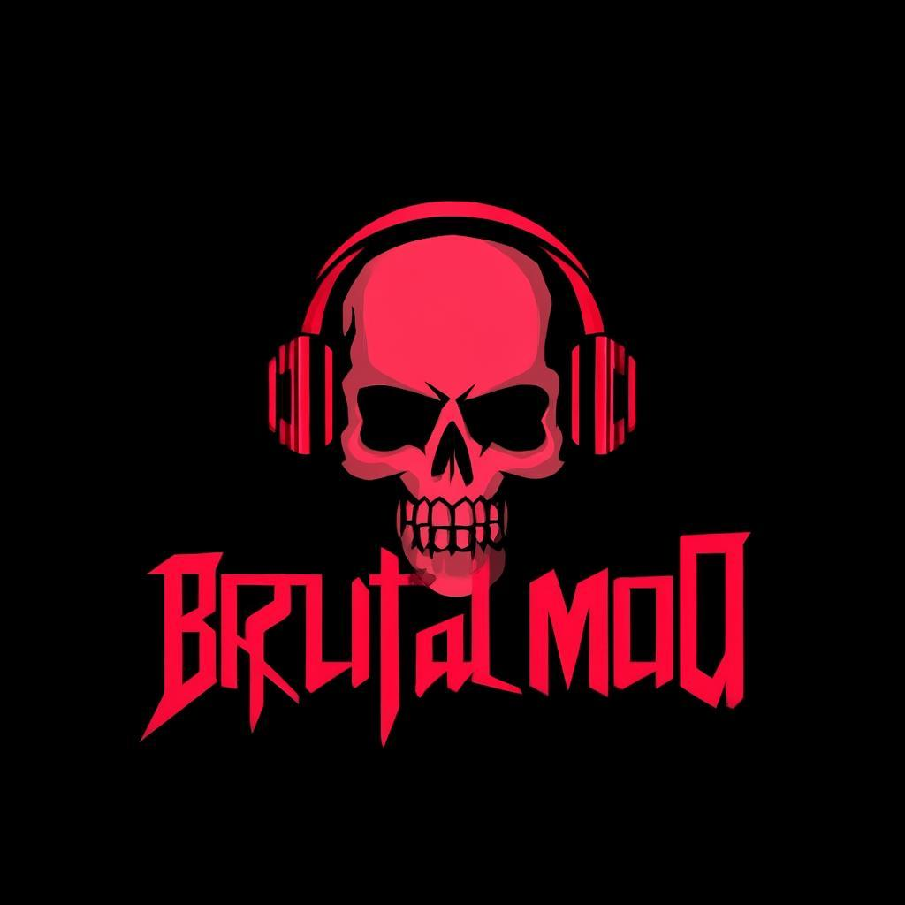
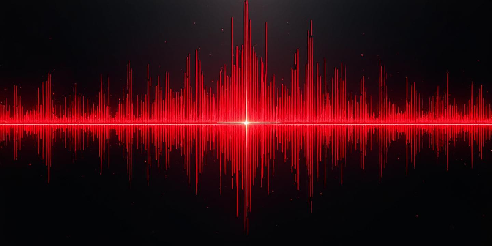

<div align="center">

# 💀 BRUTALMOD

### Professional Soundboard for Gamers

**Play sounds through your microphone in Discord, Zoom, Teams, and more!**



[](https://github.com/brutal-45/Brutal-mod/releases)
[](LICENSE)
[](https://github.com/brutal-45/Brutal-mod)
[](https://github.com/brutal-45/Brutal-mod/releases)

**🔥 DEVELOPED UNDER [BRUTALTOOLS](https://github.com/brutal-45) 🔥**

[Download](#-download) • [Features](#-features) • [Installation](#-installation) • [Usage](#-usage) • [Building](#-building-from-source)

</div>

---

## 📸 Preview

<div align="center">


*Beautiful glassmorphism UI with dark gaming aesthetic*

</div>

---

## 🎮 What is BrutalMod?

BrutalMod is a **professional, lightweight soundboard application** designed specifically for gamers. It allows you to play audio files through your microphone input, making it perfect for:

- 🎮 **Gaming** - Play meme sounds, effects, and audio clips in voice chats
- 🎬 **Streaming** - Enhance your streams with sound effects
- 💬 **Voice Chats** - Add fun to Discord, Zoom, Teams, and other platforms
- 🎭 **Content Creation** - Quick access to sound effects for videos

### Why BrutalMod?

| Feature | BrutalMod | Others |
|---------|-----------|--------|
| **Size** | ~500 KB | 50MB+ |
| **RAM Usage** | ~20 MB | 100MB+ |
| **Price** | 100% Free | $$$ |
| **UI** | Modern Glass | Outdated |
| **Hotkeys** | ✅ Global | ❌ Limited |
| **EXE Build** | ✅ Included | ❌ No |

---

## ✨ Features

### 🎨 Beautiful UI
- Modern glassmorphism design
- Dark gaming aesthetic with red accents
- Smooth animations and transitions
- Responsive layout for all screen sizes

### 🎵 Sound Management
- Add unlimited sounds (MP3, WAV, OGG, M4A, FLAC)
- Drag & drop support
- Search and filter sounds
- Organize by categories (Memes, Effects, Music, Gaming)

### ⌨️ Hotkey System
- Assign custom hotkeys (F1-F12, A-Z, 0-9)
- Global hotkeys work anywhere (EXE version)
- Visual hotkey display on each sound
- Quick assignment with one click

### 🔊 Audio Controls
- Master volume control
- Individual volume per sound
- Now playing indicator with progress
- Stop all sounds instantly

### 💾 Data Management
- Auto-save to local storage
- Import/Export configurations
- Backup your sound library
- Share sound packs with friends

### 🖥️ Two Versions
1. **HTML Version** - Just open in browser, no installation
2. **EXE Version** - Native Windows app with global hotkeys

---

## 📥 Download

### Option 1: HTML Version (Recommended for Quick Start)

[](https://github.com/brutal-45/Brutal-mod/releases/tag/V-1.0.0)

- No installation required
- Works on any OS with a browser
- ~500 KB download
- Just extract and open `index.html`

### Option 2: EXE Version (Windows App)

[](https://github.com/brutal-45/Brutal-mod/releases/tag/V-1.0.1)

- Standalone Windows application
- Global hotkeys work anywhere
- Native window controls
- Professional desktop app experience

---

## 🚀 Installation

### Quick Start (HTML Version)

```bash
# 1. Download and extract the zip file
# 2. Open index.html in your browser
# 3. Start adding sounds!
```

### Build EXE from Source

```bash
# Prerequisites: Node.js 18+ and npm

# Clone the repository
git clone https://github.com/brutal-45/Brutal-mod.git

cd brutalmod/soundboard-app

# Install dependencies
npm install

# Build for Windows
npm run build:win

# Find your exe in the 'dist' folder
```

---

## 📖 Usage

### 1. Setting Up Microphone Output

To play sounds through your microphone, you need a virtual audio cable:

#### Step 1: Install VB-Cable (Free)
```
Download from: https://vb-audio.com/Cable/
Install and restart your computer
```

#### Step 2: Configure Windows Audio
```
1. Right-click speaker icon in taskbar
2. Open Sound Settings
3. Set "CABLE Input" as Default Playback Device
```

#### Step 3: Configure Your Voice App
```
Discord: Settings → Voice → Input Device → "CABLE Output"
Zoom: Settings → Audio → Microphone → "CABLE Output"
Teams: Settings → Devices → Microphone → "CABLE Output"
```

### 2. Adding Sounds

```
Method 1: Click "Add Sound" button
Method 2: Drag & drop audio files into the app
Method 3: Place files in the 'sounds' folder
```

### 3. Setting Hotkeys

```
1. Click the ⌨ button on any sound
2. Press any key (F1-F12, A-Z, 0-9)
3. Hotkey is now assigned!
```

### 4. Playing Sounds

```
Click the sound card OR
Press the assigned hotkey
```

---

## 📁 Project Structure

```
brutalmod/
├── 📁 soundboard-app/           # Main application
│   ├── 📄 index.html            # HTML app entry point
│   ├── 📄 styles.css            # UI styles
│   ├── 📄 app.js                # Application logic
│   ├── 📄 main.js               # Electron main process
│   ├── 📄 preload.js            # Electron preload script
│   ├── 📄 package.json          # Node.js configuration
│   ├── 📄 build.bat             # Windows build script
│   ├── 📄 build.sh              # Mac/Linux build script
│   ├── 📄 README.txt            # Quick start guide
│   └── 📁 sounds/               # Audio files folder
│
├── 📁 src/                      # Landing page (Next.js)
│   ├── 📁 app/
│   │   ├── 📄 page.tsx          # Landing page
│   │   ├── 📄 layout.tsx        # Root layout
│   │   └── 📁 api/
│   │       └── 📁 download/
│   │           └── 📄 route.ts  # Download API
│   └── 📁 components/           # UI components
│
├── 📁 public/                   # Static assets
│   ├── 🖼️ brutalmod-logo.png    # App logo
│   └── 🖼️ brutalmod-hero.png    # Hero image
│
├── 📄 README.md                 # This file
├── 📄 package.json              # Project dependencies
└── 📄 LICENSE                   # MIT License
```

---

## 🔧 Building from Source

### Prerequisites

- [Node.js](https://nodejs.org/) 18.0 or higher
- [npm](https://www.npmjs.com/) 9.0 or higher

### Build Steps

#### For HTML Version But html is only for see the app as native applications
```bash
# No build required! Just open index.html
# Or create a zip for distribution:
cd soundboard-app
zip -r ../brutalmod-html.zip *
```

#### For Windows EXE
```bash
cd soundboard-app
npm install
npm run build:win
# Output: dist/BrutalMod Setup 1.0.0.exe
```

#### For macOS
```bash
cd soundboard-app
npm install
npm run build:mac
# Output: dist/BrutalMod-1.0.0.dmg
```

#### For Linux
```bash
cd soundboard-app
npm install
npm run build:linux
# Output: dist/BrutalMod-1.0.0.AppImage
```

---

## ⚙️ Configuration

### Settings Available

| Setting | Description | Default |
|---------|-------------|---------|
| Theme | UI color scheme | Dark (Brutal) |
| Animations | UI animations | Enabled |
| Master Volume | Global volume level | 80% |
| Stop Hotkey | Key to stop all sounds | Escape |

### Data Storage

- Sounds are stored in browser's localStorage
- Export configs for backup
- Import to restore settings

---

## 🤝 Contributing

Contributions are welcome! Here's how you can help:

### Report Bugs
```
Open an issue with:
- Description of the bug
- Steps to reproduce
- Expected behavior
- Screenshots (if applicable)
```

### Suggest Features
```
Open an issue with:
- Feature description
- Use case
- Possible implementation
```

### Submit Pull Requests
```bash
1. Fork the repository
2. Create a feature branch (git checkout -b feature/amazing-feature)
3. Commit changes (git commit -m 'Add amazing feature')
4. Push to branch (git push origin feature/amazing-feature)
5. Open a Pull Request
```

---

## 📋 Roadmap

- [ ] Sound waveform visualization
- [ ] Sound editing (trim, fade)
- [ ] Online sound library
- [ ] Multi-output device support
- [ ] Sound packs marketplace
- [ ] Mobile companion app
- [ ] OBS integration
- [ ] Discord Rich Presence

---

## ❓ FAQ

<details>
<summary><strong>How do I play sounds through my microphone?</strong></summary>

You need to install a virtual audio cable like VB-Cable (free). Set VB-Cable Input as your default playback device, and in your voice app, set the microphone to VB-Cable Output. Now all sounds from BrutalMod will play through your mic!

</details>

<details>
<summary><strong>Why aren't my hotkeys working?</strong></summary>

For the HTML version, make sure the browser window is focused. For the EXE version, hotkeys work globally from anywhere. Make sure no other app is using the same hotkey.

</details>

<details>
<summary><strong>Where are my sounds stored?</strong></summary>

Sounds are stored in your browser's localStorage. Use the Export feature to backup your configuration. You can also share configs with friends!

</details>

<details>
<summary><strong>Can I use this on Mac/Linux?</strong></summary>

Yes! The HTML version works on any OS with a modern browser. You can also build native apps for Mac and Linux using the build scripts included.

</details>

<details>
<summary><strong>Is this free?</strong></summary>

Yes! BrutalMod is 100% free and open source under the MIT license. No ads, no premium version, no limitations.

</details>

---

## 📊 Tech Stack

| Technology | Purpose |
|------------|---------|
|  | App structure |
|  | Styling |
|  | App logic |
|  | Desktop app |
|  | Landing page |
|  | Type safety |

---

## 📄 License

This project is licensed under the MIT License - see the [LICENSE](LICENSE) file for details.

```
MIT License

Copyright (c) 2024 BrutalTools

Permission is hereby granted, free of charge, to any person obtaining a copy
of this software and associated documentation files (the "Software"), to deal
in the Software without restriction, including without limitation the rights
to use, copy, modify, merge, publish, distribute, sublicense, and/or sell
copies of the Software, and to permit persons to whom the Software is
furnished to do so, subject to the following conditions:

The above copyright notice and this permission notice shall be included in all
copies or substantial portions of the Software.
```

---

## 🙏 Acknowledgments

- [VB-Audio](https://vb-audio.com/) - For the free virtual audio cable
- [Electron](https://www.electronjs.org/) - For making desktop apps easy
- [Inter Font](https://rsms.me/inter/) - Beautiful typeface
- All our contributors and users!

---

## 📞 Support

- 📧 Email: creatorsports81@gmail.com
- 💬 Discord: [Join our server](https://discord.gg/)
- 🐛 Issues: [GitHub Issues](https://github.com/brutal-45/Brutal-mod/issues)
- 📖 Wiki: [Documentation](https://github.com/brutal-45/Brutal-mod/wiki)

---

<div align="center">

### 💀 DOMINATE VOICE CHAT WITH BRUTALMOD! 💀

**🔥 DEVELOPED UNDER [BRUTALTOOLS](https://github.com/Brutal-45) 🔥**

[](https://github.com/brutal-45/Brutal-mod)
[](https://github.com/brutal-45/Brutal-mod/fork)
[](https://github.com/brutal-45/Brutal-mod)

**Made with 💀 by the BrutalTools Team**

</div>
